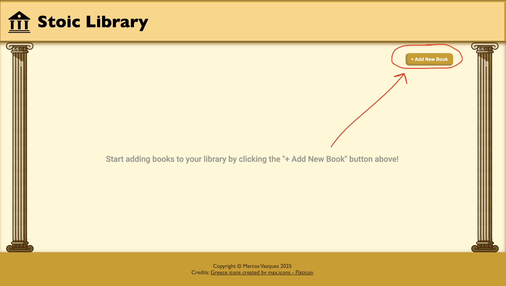
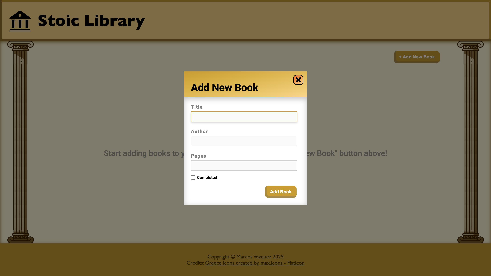
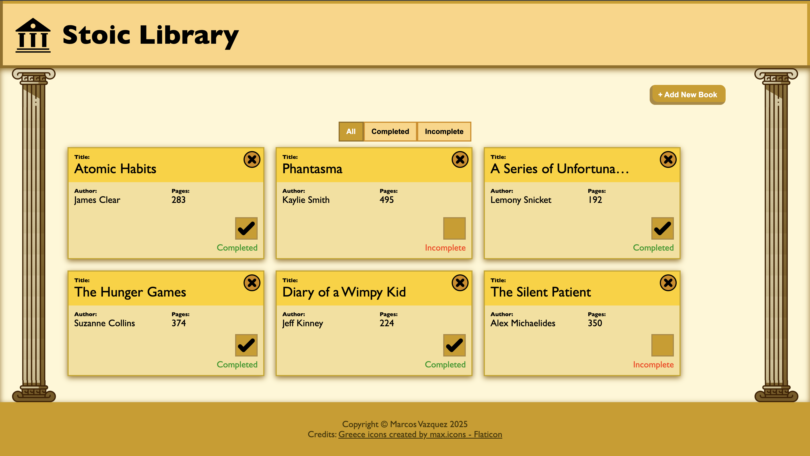

# Stoic Library
The Stoic Library is a small app that allows users to manage their favorite books. Each book added by the user contains the title, author, number of pages, and a status indicating whether it has been completed/read.

This project was implemented using HTML, CSS, and Javascript, with a stronger emphasis on Javascript. It focuses on understanding how to create objects, associate DOM elements with those objects, filter objects, and utilize the book object's prototype. This project also helped me become familiar with custom CSS properties, semantic HTML, and more advanced CSS styling.

## How it Works
The webpage displays an initial message at the center of the application, directing you to the "+ Add New Book" button. This will allow you to create the books you want to manage.

After clicking on that button, a popup form will display, prompting you to input all the necessary details about the book and whether or not you have completed it.

Once you have inputted everything into the required fields, you can add the book and see it in your library. If you have more books, just repeat the steps mentioned above!

If you wish to remove a book from the library, just click on the button at the top right corner of the book card. If you have finished reading a book, you can update its completion status by clicking on the checkbox. This will change the text from "Incomplete" to "Completed". Finally, you can filter books based on whether they are completed or incomplete.

> **Note:** If the title or author of the book is too long, the extra text will be cut off and replaced with ellipses.

